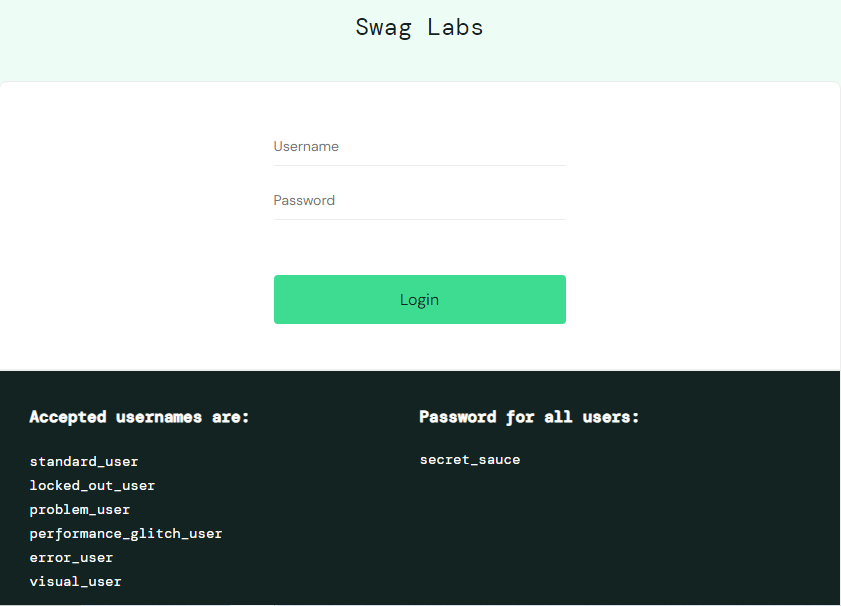
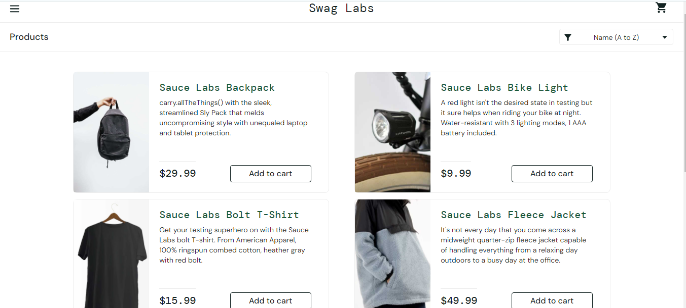
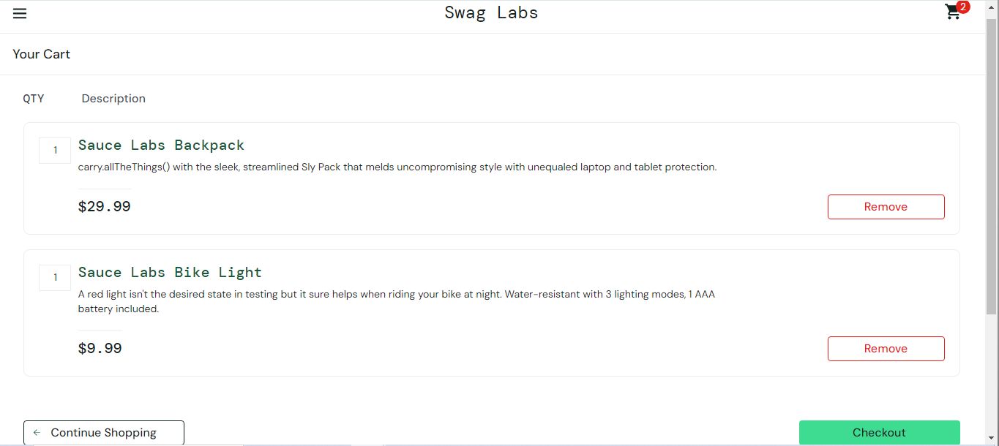
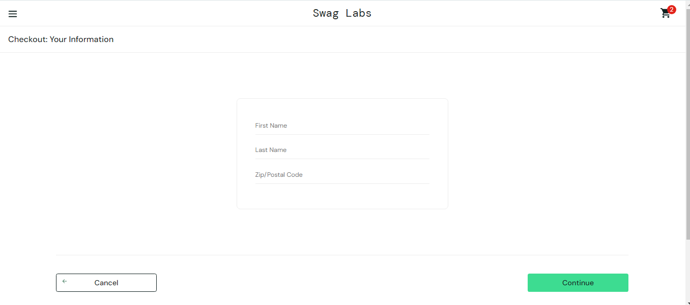
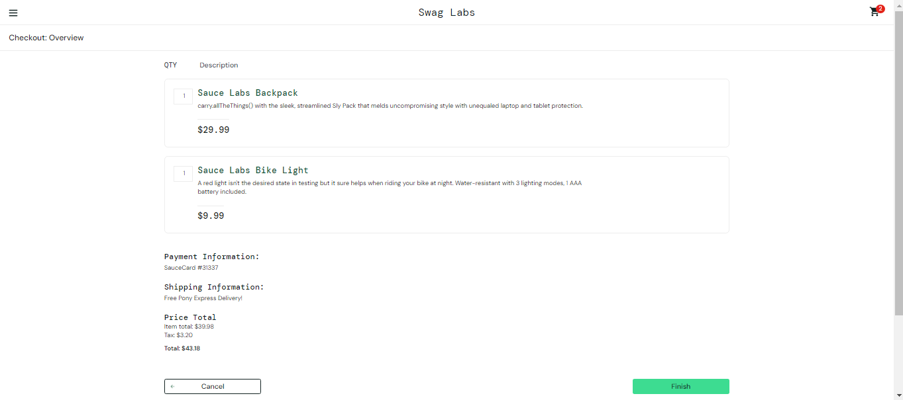
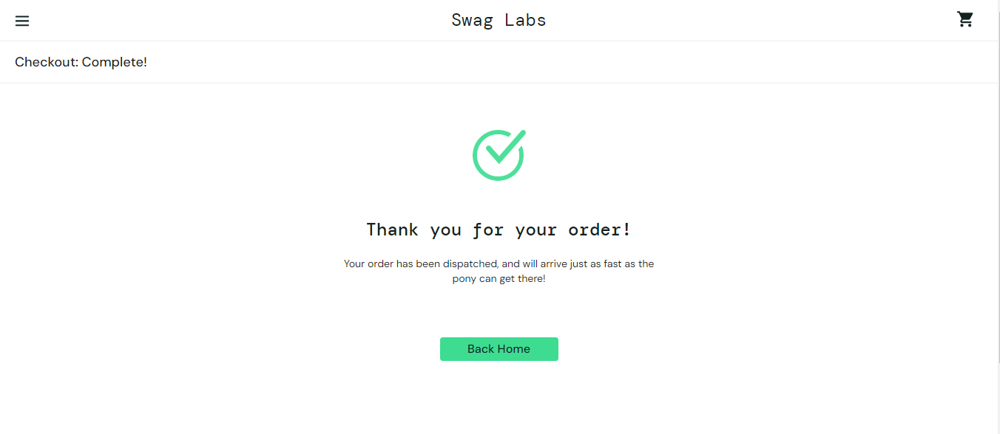

# Desafio-Vox
Desafio técnico para a posição de QA com foco em automação de testes front-end no ambiente Sauce Demo utilizando Cypress com JavaScript, Cucumber e gerenciando massas via Json.

## Índice
- <a href="#objetivos">Objetivos</a> 
- <a href="#funcionalidades-do-projeto">Funcionalidades do Projeto</a> 
- <a href="#layout">Layout</a>
- <a href="#como-rodar-este-projeto">Como rodar este projeto?</a>
- <a href="#tecnologias-utilizadas">Tecnologias utilizadas</a>
- <a href="#pessoas-autoras">Pessoas autoras</a>
- <a href="#contatos">Contatos</a>

## Objetivos
- Automação de testes de front-end.
- Utilizar o Cypress para interagir com elementos web.
- Implementar testes para garantir a funcionalidade e integridade da interface do usuário.
- Explorar boas práticas e padrões de design para automação de testes em JavaScript em BDD.

## Funcionalidades do Projeto
- [x] Login
- [x] Visualização de Produtos
- [x] Adicionar ao Carrinho
- [x] Remover do Carrinho
- [x] Finalizar Compra

## Layout







## Como rodar este projeto?
```bash
# Clone este repositório
$ git clone https://github.com/LucasFelice/Desafio-Vox.git

# Acesse a pasta do projeto no seu terminal
$ cd Desafio-vox

# Instale as dependências
$ npm install

# Execute a aplicação
$ npm run dev ⇢ Abre a interface do cypress
$ npm run allure:chrome ⇢ Esse comando irá executar os testes no navegador Chrome e gerar os resultados no diretório "allure-results".
$ npm run allure:report ⇢ Esse comando irá gerar o relatório Allure a partir dos resultados e abrir o relatório no navegador.
$ Obs.: Foi feita a configuração do Allure via Mocha.
```
## Tecnologias Utilizadas
1. [Cypress](https://www.cypress.io/)
2. [JavaScript](https://www.javascript.com/)
3. [Cucumber](https://cucumber.io/)
4. [Allure-reports](https://allurereport.org/docs/mocha-reference/)
5. [Node.js](https://nodejs.org/pt)

## Pessoas Autoras


## Contatos
- E-mail: lucasfelice92@gmail.com
- Linkedin: https://www.linkedin.com/in/lucas-de-felice-fernandes-92122b149/
- Github: https://github.com/LucasFelice


<!--  -->